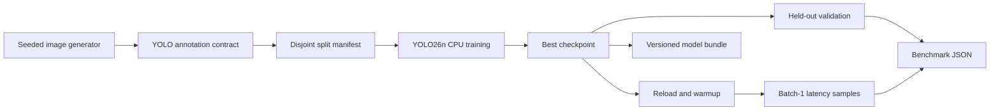

# #1 yolo-training-pipeline

> **Measured baseline:** median held-out mAP50-95 `0.002420`; warmed p95 `68.303 ms/image` across three complete CPU runs.

The container embeds the local font asset required by Ultralytics, so the default run performs no dataset, model-weight, or auxiliary font download. Publication evidence binds the source commit, OCI image digest, raw run files, workload configuration, dependency lock and aggregate result.

This repository proves the engineering path around YOLO training: deterministic local data, annotation validation, architecture-only initialization, CPU training, held-out evaluation, best-checkpoint reload, versioned checkpoint/manifest bundle, inference timing, and machine-readable evidence.

## Run

```bash
docker build -t yolo-training-pipeline .
docker run --rm yolo-training-pipeline
```

The default run needs no API key, GPU, cloud account, pretrained weight, dataset download, broker, database, or host Python. Docker is the same entrypoint on Linux, macOS, and Windows.

## Proof Contract

| Metric | Publication value | What it proves |
|---|---:|---|
| Held-out mAP50-95 median | 0.002420 ratio | Detection quality over IoU thresholds 0.50 through 0.95 |
| Held-out mAP50 median | 0.008863 ratio | Easier-to-read localization/classification signal at IoU 0.50 |
| Inference p95 median | 68.303 ms/image | Warmed batch-1 wall time after reloading the best checkpoint |
| Training time median | 199.350 s | CPU train-to-best-checkpoint cost for the fixed fixture |
| Checkpoint size | 5,333,317 bytes | Artifact footprint carried into later serving repositories |

The committed publication result is the median of three complete runs. Raw JSON remains under `benchmarks/results/`; failed runs are not replaced by a faster sample. All three runs used seed 42, four Torch threads, and the same image ID.

## Fixture

The runtime generates 80 training and 20 held-out validation images at 160 x 160 pixels. Each image contains one warm rectangle or cool ellipse over deterministic distractors, represented in normalized YOLO detection format.

The generator records image and label hashes, class map, dimensions, seed, split counts, annotation license, and a dataset hash. Train and validation content hashes must be disjoint before training starts.

This synthetic fixture measures pipeline correctness and reproducibility. Its mAP is not evidence of performance on traffic, medical, industrial, or natural-image data.

## System



Pipeline architecture is primary because ordered artifact transitions dominate. Pure code owns annotation rules, percentile calculation, and multi-run aggregation. Ultralytics owns training, validation, and prediction; wrapping those calls behind empty interfaces would add indirection without substitution value.

## Decisions

- **YOLO26n from YAML:** proves training without downloading mutable pretrained weights.
- **Ultralytics 8.4.96:** matches the named YOLO workflow and exposes mAP, validation, and prediction surfaces.
- **AGPL-3.0-only:** aligns the repository with the open-source Ultralytics license; commercial use may require a separate Ultralytics Enterprise license.
- **CPU-only PyTorch:** keeps the default path universal and CI-reproducible. GPU performance is a different benchmark.
- **No COCO8 download:** the official dataset is useful for smoke testing, but first use is network-dependent and its validation split has four images.
- **No API/export/registry:** #7 consumes the checkpoint for serving; #21 owns lifecycle governance; export comparison deserves its own measured question.
- **No cloud:** no AWS behavior exists. Kumo becomes relevant only when an actual AWS storage or training contract enters scope.

OpenSpec records the self-challenge and revisit triggers; SDD records the implementation and benchmark contract.

## Evidence Output

Set `BENCHMARK_OUTPUT` to a mounted path to retain one run. After three files named `run-*.json`, aggregate them with the same image:

```bash
docker run --rm yolo-training-pipeline aggregate --input-dir /results --output /results/summary.json
```

A bind mount is required for `/results`; use the native Docker bind-mount syntax of the host shell. The default command still prints and writes one complete result inside the container. Set `MODEL_ARTIFACT_DIR` to a mounted `/artifacts` directory to retain `best.pt` and `model-manifest.json` for #7.

## Verification

```bash
docker run --rm --entrypoint ruff yolo-training-pipeline check src tests
docker run --rm --entrypoint pytest yolo-training-pipeline -q
docker run --rm --entrypoint pytest yolo-training-pipeline tests/test_domain.py tests/test_dataset.py tests/test_artifact.py tests/test_config.py --cov=yolo_training_pipeline.domain --cov=yolo_training_pipeline.dataset --cov=yolo_training_pipeline.artifact --cov=yolo_training_pipeline.config --cov-fail-under=90
```

Pure tests do not train a model. The default Docker run is the integration proof that generates data, trains, validates, reloads the checkpoint, predicts, and emits JSON.

## Reuse

This repository created the reusable `python-computer-vision` skill and computer-vision standard in `portfolio-reuse-kit`. Product-specific generator, training choices, fixture, and checkpoint code stay here until another project demonstrates stable duplication.

See [REFERENCES.md](REFERENCES.md) for framework, metric, runtime, license, and organizational references.
