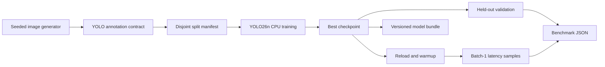

# YOLO Training Pipeline: Reproducible CPU Path from Data to Versioned Checkpoint

**Seeded data to a versioned, reloadable YOLO checkpoint in one offline container**, with warmed inference p95 `68.303 ms/image` across three complete CPU runs. The held-out mAP50-95 of `0.002420` comes from an 80-image from-scratch smoke run: it proves the pipeline executes end to end and is not a detector-quality claim.

[](https://github.com/Brilhante29/yolo-training-pipeline/actions/workflows/validate.yml)
[](LICENSE)


## Why this exists

In applied computer-vision work (I have co-authored YOLO-based detection research in medical imaging), the model is rarely what breaks. What breaks is everything around it: annotations that silently drift from the YOLO format, validation images that also appear in training, a "best" checkpoint nobody can reload, or a result that cannot be rerun because the run downloaded mutable weights.

This repository is that surrounding engineering, made reproducible:

- a seeded generator produces images and YOLO labels, with content hashes for every file;
- train and validation hashes must be disjoint before training starts;
- the model is initialized from architecture YAML only, so no mutable pretrained weight is downloaded;
- the best checkpoint is reloaded, warmed up, timed, and packaged with a manifest that [vision-serving-fastapi](https://github.com/Brilhante29/vision-serving-fastapi) verifies before serving.

## Results

The publication value is the median of three complete runs (seed 42, four Torch threads, same image ID). Failed runs are never replaced by a faster sample.

| Metric | Publication value | What it shows |
|---|---:|---|
| Inference p95 median | 68.303 ms/image | Warmed batch-1 wall time after reloading the best checkpoint |
| Training time median | 199.350 s | CPU cost from data to best checkpoint on the fixed fixture |
| Checkpoint size | 5,333,317 bytes | Artifact footprint carried into serving |
| Held-out mAP50 median | 0.008863 ratio | Smoke-run signal at IoU 0.50 |
| Held-out mAP50-95 median | 0.002420 ratio | Smoke-run signal over IoU 0.50 to 0.95 |

Why mAP is near zero: 80 training images at 160x160 pixels, 25 CPU epochs, and no pretrained backbone. Quality is out of scope on purpose; with pretrained weights and a real dataset, the same pipeline is where a meaningful mAP would be produced.

## Quickstart

```bash
docker build -t yolo-training-pipeline .
docker run --rm yolo-training-pipeline
```

The default run needs no API key, GPU, cloud account, pretrained weight, dataset download, database, or host Python. The container embeds the font asset Ultralytics expects, so nothing is fetched at runtime.

Keep artifacts and aggregate runs (bind-mount `/results` and `/artifacts` with your shell's syntax):

```bash
# BENCHMARK_OUTPUT keeps one run; MODEL_ARTIFACT_DIR keeps best.pt and model-manifest.json
docker run --rm yolo-training-pipeline aggregate --input-dir /results --output /results/summary.json
```

## How it works


```mermaid
flowchart LR
  A["Seeded image generator"] --> B["YOLO annotation contract"]
  B --> C["Disjoint split manifest"]
  C --> D["YOLO26n CPU training"]
  D --> E["Best checkpoint"]
  E --> F["Held-out validation"]
  E --> G["Reload and warmup"]
  E --> J["Versioned model bundle"]
  G --> H["Batch-1 latency samples"]
  F --> I["Benchmark JSON"]
  H --> I
```

The fixture holds 80 training and 20 validation images at 160x160, each with one warm rectangle or cool ellipse over deterministic distractors. Pure code owns annotation rules, percentile math, and multi-run aggregation; Ultralytics owns training, validation, and prediction, and is called directly rather than hidden behind interfaces with nothing to substitute.

## Design decisions

| Decision | Why | Rejected |
|---|---|---|
| YOLO26n from YAML | Proves training without mutable pretrained downloads | Pretrained weights fetched at runtime |
| Ultralytics 8.4.96, CPU PyTorch | Universal, CI-reproducible default path | GPU-only path (a different benchmark) |
| Generated fixture | Offline, hash-verified, leakage-checked | COCO8 download (network-dependent, four validation images) |
| AGPL-3.0-only | Matches the open-source Ultralytics license | Permissive license incompatible with the dependency |
| No API, registry, or export here | Serving and lifecycle live in [vision-serving-fastapi](https://github.com/Brilhante29/vision-serving-fastapi) and [mlops-end2end](https://github.com/Brilhante29/mlops-end2end) | One repository doing everything |

## Testing

```bash
docker run --rm --entrypoint ruff yolo-training-pipeline check src tests
docker run --rm --entrypoint pytest yolo-training-pipeline -q
```

Unit tests cover annotations, split hashing, artifacts, and configuration without training, with a 90% coverage gate on the pure modules. The default Docker run is the integration test: it generates data, trains, validates, reloads, predicts, and emits JSON.

## Limitations

- Synthetic shapes only; the mAP is not evidence for traffic, medical, industrial, or natural images.
- CPU timing on one machine class; GPU throughput is not measured.
- Commercial use may require a separate Ultralytics license.

## Reproducibility

- Raw runs: [`benchmarks/results/`](benchmarks/results/).
- Publication evidence (source commit, OCI image digest, workload, lock): [`benchmarks/publication/yolo-training-v2.json`](benchmarks/publication/yolo-training-v2.json).

## Project structure

```text
src/yolo_training_pipeline/   dataset, domain, config, pipeline, artifact, CLI
tests/                        unit tests for the pure modules
benchmarks/                   raw runs and V2 publication evidence
tools/                        benchmark and publication validators
sdd/  openspec/               specification, decisions, revisit triggers
```

## How this repository is built

The project follows the spec-driven workflow of [portfolio-reuse-kit](https://github.com/Brilhante29/portfolio-reuse-kit), where this repository originated the shared `python-computer-vision` standard. Requirements and decisions live in [`sdd/`](sdd) and [`openspec/`](openspec), and [`project.yaml`](project.yaml) records the architecture, stack, and rejected alternatives. Development is AI-assisted and human-governed: [`AGENTS.md`](AGENTS.md) and [`CLAUDE.md`](CLAUDE.md) hold the coding-agent instructions, while tests, validators, and CI decide what gets published.

## Related work

- [Health of Things Melanoma Detection System](https://doi.org/10.3389/frcmn.2024.1376191) (YOLOv8 at the edge), Frontiers in Communications and Networks, 2024.
- [vision-serving-fastapi](https://github.com/Brilhante29/vision-serving-fastapi): serves the checkpoint this pipeline produces.

See [`REFERENCES.md`](REFERENCES.md) for framework, metric, runtime, and license references.

## Author

**Guilherme Brilhante**, software engineer working on scalable backends and production AI.
[LinkedIn](https://www.linkedin.com/in/guilhermefreirebrilhanteseveriano/) · [GitHub](https://github.com/Brilhante29) · [Publications](https://dblp.org/pid/353/6812.html)

## License

[AGPL-3.0-only](LICENSE), aligned with Ultralytics.
